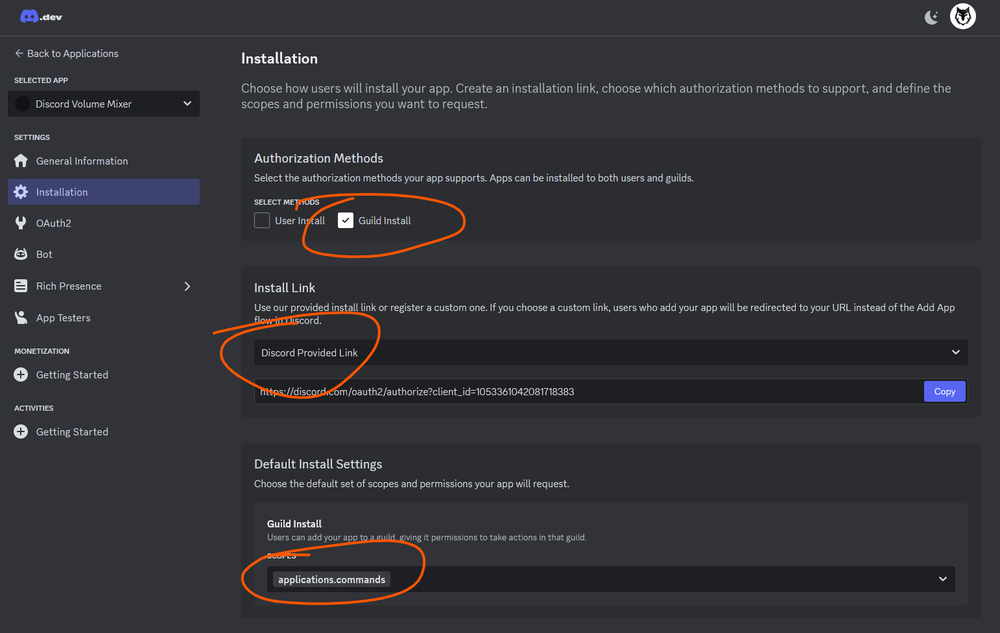
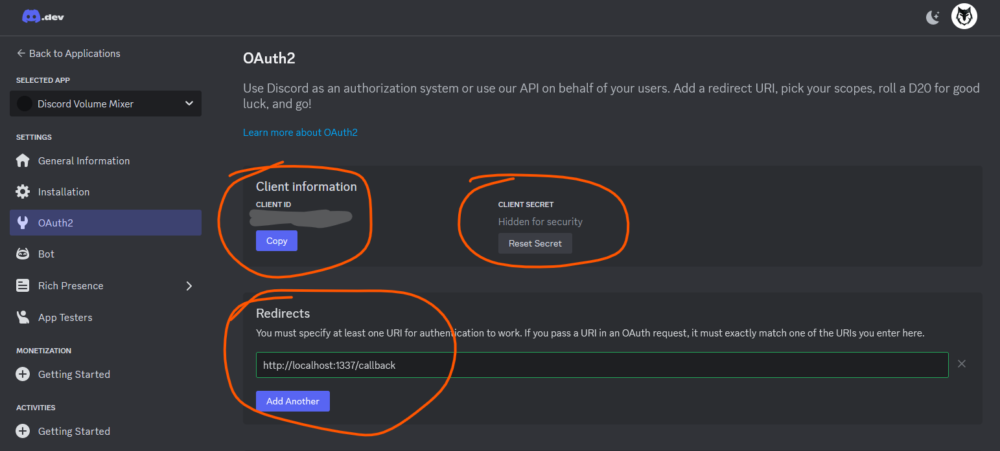
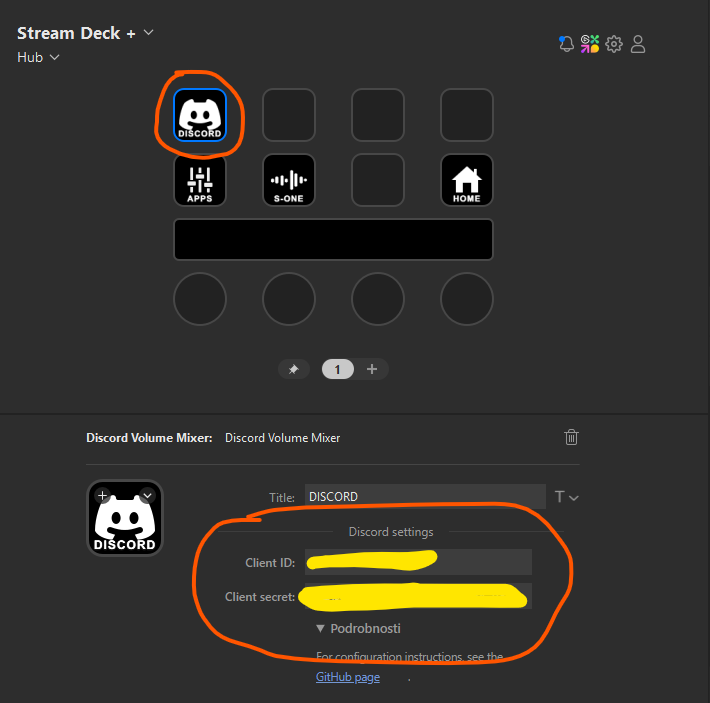

# Discord Volume Mixer 3 (Stream Deck plugin)

A maintained fork of [Stream Deck Discord Volume Mixer 2](https://github.com/CZDanol/StreamDeck-DiscordVolumeMixer2) by CZDanol, with performance and correctness fixes plus Legcord support. Full credit to the original authors is in the [Credits](#credits) section below.

This is a plugin for Stream Deck for managing Discord Voice chats:
* Shows list of people in your voice chat.
* You can **adjust volume** for each user.
* You can **mute** each user by clicking on his name button.
* **Indication** when a user is **speaking**.
* **Self mute and deafen** buttons (deafen only on XL, mute on XL and STD)
* Supports **Standard, Mini, XL, Mobile and SD+ Decks**.
* You can adjust the audio mixer panel to your needs, it's quite modular - you can move buttons around etc.
* Requires Stream Deck 7.4 or newer on Windows 10 x64 or newer.

## Support

### Common problems:
* Stuck on `Loading property inspector...`
	* Try installing the [MSVC 2019 x64 runtime](https://learn.microsoft.com/en-us/cpp/windows/latest-supported-vc-redist?view=msvc-170).

* `ERR 0`: Missing client ID/secret
	* For Discord, you haven't filled the credentials. See the Configuration section below.
	* For Legcord, install and enable the bundled Legcord bridge plugin.

* `ERR L`: Could not connect to the Legcord bridge
	* Make sure Legcord is running.
	* Make sure `legcord-dvm-bridge` is installed and enabled in Legcord's Plugins settings.

* `ERR 1`: Could not connect to Discord
	 * Check that the Discord app is running.
	 * Check that the plugin is not blocked by firewall.
	 * Check that you're not running Discord or the Stream Deck software under different privilleges (say as admin).
	 * Try restarting the Discord.

* `ERR 2`: Your credentials are wrong
	* Check that you've configured everything properly on the Discord Developer Portal, it has to be exactly as in the screenshot in the Configuration section.
	* Make sure that you're connected on the Discord with the same account you've used on the Discord Developer Portal.
	* Try resetting your Client secret in the Discord Developer Portal and putting a new one into the plugin.
	* After everything, restart the Discord client.

* `ERR 4`: Double check that you're using the same account in the Discord App as in the Developer Portal.

* `ERR 8`:
	* Make sure your app in the Discord Developer Portal doesn't contain the word "Discord" in the name.
	* Triple check the configuration in the Discord Developer Portal.
	* Turn off both Discord and Stream Deck software. Then turn on Discord. After it fully loads, turn on Stream Deck.

* Avatars are not visible, otherwise everything works.
	* Update the Stream Deck software.

### Troubleshooting
* **!!! First read Configuration below !!!**
* If the plugin does not work:
	* Check the "common problems" above.
  	* Try uninstalling and reinstalling it.
  	* Make sure you're not running the Discord or the Stream Deck software with administrator privileges.
	* Check if there are not multiple profiles for "Discord Volume Mixer". If yes, remove them all and try again.

## Configuration
### Discord
1. Download and install the plugin from [the releases](https://github.com/dylanjkl/StreamDeck-DiscordVolumeMixer3/releases).
2. Add the "Discord Volume Mixer" button on your deck.
3. Go to the [Discord developer portal](https://discordapp.com/developers) (if the link asks you for login and then shows the Discord app, close the window and click this link again) and create an application.
	 * **You must use the same account in to the Developer portal as in your Discord application, otherwise it won't work.** (You can add the other account as app tester though.)
	 * You're setting this stuff up for your own account, not for any bot or anything else.
4. Create a new application. You can name it however you like, for example "DVM".
	 * **Do not use "Discord" in the name of the app, [apparently the Discord doesn't like it.](https://github.com/CZDanol/StreamDeck-DiscordVolumeMixer2/issues/26)**
6. In the newly created application under "Installation" (this page could be hidden under the menu button on the top left corner in smaller windows), set "Install link" to "Discord provided link".
7. Hit "Save changes".
8. Under "OAuth2", add redirect to `http://localhost:1337/callback`
9. Hit "Save changes".
10. Copy `Client ID` and `Client secret` and paste it in your Discord Volume Mixer button settings (the button used to access the volume mixer).
	 * If you don't see the client secret, but only the "Reset Secret" button, simply click on the button, it will give you a new secret.
11. Click on the Discord Volume Mixer button. Discord will ask you for some permissions & firewall and stuff.
12. Done.

**Don't play with the configuration of the buttons in the Volume Mixer profile unless you know what you're doing.**

### Legcord
Legcord needs the bundled bridge because its built-in arRPC server does not expose the Discord voice mixer RPC commands used by this plugin. The bridge supports Legcord 1.2.x as a local extension and newer runtime-plugin builds through the same folder.

1. Copy `legcord-dvm-bridge` into Legcord's runtime plugin folder:
	 * Windows: `%APPDATA%\Legcord\plugins\legcord-dvm-bridge`
2. Restart Legcord.
3. Open Legcord's Plugins settings and enable `Discord Volume Mixer Bridge` if it is listed.
4. In the Stream Deck plugin settings, leave `Client ID` and `Client secret` empty.
5. Add the "Discord Volume Mixer" button on your deck.

## Third-party libraries, credits
* Qt 6 (Core, WebSockets, Network, Gui)
* [QtStreamDeck2](https://github.com/CZDanol/QtStreamDeck2) for Stream Deck control.
* [QtDiscordIPC](https://github.com/CZDanol/QtDiscordIPC/) for Discord control (IPC through QLocalSocket).
* [Icons8 icons](https://icons8.com/)

### Credits
This project is a fork of [Stream Deck Discord Volume Mixer 2](https://github.com/CZDanol/StreamDeck-DiscordVolumeMixer2). All credit for the original plugin goes to its authors:
* **[CZDanol (Danol)](https://github.com/CZDanol)** — original author and maintainer.
* **[FynnleyNeko (Fynnley)](https://github.com/FynnleyNeko)** — contributor.

* Big kudos to [Krabs](https://github.com/krabs-github) for helping with profiles for the XL version, testing, and overall being awesome.
